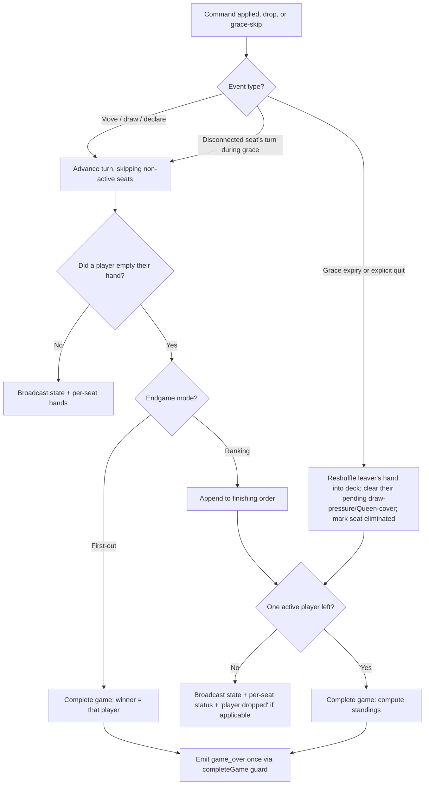

# feat: 3-4 Player Online Multiplayer

## Summary

Extend online play from two players to a host-chosen 2-4. The card engine is already player-count generic, so the work is: widen the capacity policy, add a host-selectable endgame mode (Ranking vs First-out) in the shared engine, make mid-game departure a grace-then-drop-and-continue that reshuffles the leaver's hand and ends only at one active player, and replace the single-opponent online screen with a table-perimeter multi-opponent view that degrades to today's 2-player layout.

---

## Problem Frame

Two-player is enforced by a policy cap, not the rules engine (see origin: `docs/brainstorms/2026-07-17-three-to-four-player-online-requirements.md`). Three things are two-player-shaped: the capacity gate (`MIN_MAX_PLAYERS`/`MAX_MAX_PLAYERS` both 2, `startGame` requires exactly 2 connected, `create_room` never forwards a size), the endgame (`isGameOver` ends on the first empty hand; `forfeitActivePlayer` awards "the opponent" the win), and the online screen (`MultiplayerGameScreen` renders a single opponent). The engine in `packages/game-core/src/gameLogic.ts` already advances turns, skips, reverses, and chains draw pressure over any player count — but `nextPlayerIndex` has no seat-status awareness, and turn advancement is spread across many call sites. This plan lifts the policy and builds the multi-player endgame, drop handling, and UI that the two-player MVP deferred.

---

## Key Technical Decisions

- KTD1. Endgame mode is a room-level setting threaded into a mode-aware end evaluation; `game-core` stays pure by taking the mode as a parameter rather than reading global state. Mode lives on `RoomInfo`/room data and is chosen at room creation.
- KTD2. Standings order (Ranking mode), best to worst: finishers by the order they emptied their hands, then the lone remaining survivor, then dropped players by drop order (earlier drop ranks higher, later drop lower). Winner is the first finisher, or the survivor when no one ever went out. This makes the drop-order clause of origin R11 ("a later removal ranks lower") authoritative: in the interleaved case where a player who was still active at an earlier drop later drops themselves, drop order takes precedence over R11's "below everyone still in at removal time" clause. That precedence matches the origin's stated intent ("leaving is effectively coming last; later leaver ranks worse") and is the deterministic total order the engine computes. A test must cover the interleaved drop+finish case (see U5).
- KTD3. Seat lifecycle: the frozen `seatOrder` stays fixed-length for index stability; add a per-seat status (`active` / `finished` / `eliminated`) rather than mutating `seatOrder` or shrinking `gameState.players`. Turn advancement skips seats that are not `active`.
- KTD4. A dropped player's hand is shuffled back into the draw deck via a `game-core` function, keeping cards in circulation (origin R12). Elimination/finish state and the drop-order ledger live in `game-core`'s `GameState` (not server-side) so the endgame is deterministic and unit-testable in one place; the server owns only the trigger (grace expiry / explicit leave) and the wire projection. The rejected alternative — a pure engine plus a server-owned drop ledger and standings merge — was set aside because splitting standings across two layers makes the ordering rules in KTD2 harder to test.
- KTD5. Reuse the existing grace-timer registry (`server/src/graceTimers.ts`, 30s) and the single-fire `completeGame` guard. `forfeitActivePlayer` becomes conditional — remove-and-continue while 2+ active players remain, complete only when one remains — so no new disconnect system is introduced.
- KTD6. New domain rejections extend the typed-error pattern in `server/src/roomErrors.ts` and the `ProtocolErrorCode` union in `packages/game-core/src/protocol.ts`; never reintroduce `Error.message` string matching in `validatedHandler.ts`.
- KTD7. The `game_over` payload carries a finishing order (standings) and a richer reason (`first_out` / `last_standing`); the public view carries explicit per-seat status (`active` / `finished` / `eliminated`) so clients distinguish a finisher from a dropout without inferring from `handCount`. A separate "player dropped, game continues" broadcast (distinct from `game_over`) covers the non-terminal drop. The legacy 2-player `forfeit` reason is retained for the 2-player complete path; `last_standing` is the N-player drop-to-one reason.
- KTD8. The endgame-mode selector appears only when the host targets 3-4 players; at a 2-player target it is hidden, because Ranking and First-out are identical with one opponent (origin R17). This resolves the origin's open UX question in favor of hiding rather than disabling.
- KTD9. Multi-opponent UI reuses the existing `components/PlayerArea.tsx` per opponent inside a new perimeter layout wrapper, and generalizes `components/GameOverOverlay.tsx` from a `you / opponent / draw` outcome to an N-player winner plus optional ranking. The 2-player case renders the single opponent at the top exactly as today.

---

## High-Level Technical Design

The per-turn and departure lifecycle after a command is applied. The mode branch (KTD1) and the conditional drop (KTD5) are the two new gates on top of the existing "apply → broadcast → check game over" flow. "Advance turn" everywhere skips seats that are not `active` (finished, eliminated, or disconnected-mid-grace).

---

## Requirements

Carried from origin (`docs/brainstorms/2026-07-17-three-to-four-player-online-requirements.md`), grouped by concern.

**Room setup and start**

- R1. Host chooses a target player count of 2, 3, or 4 at room creation; the target is a cap, not a required fill count.
- R2. When the target is 3 or 4, the host chooses an endgame mode (Ranking or First-out) at room creation.
- R3. Host can start once at least two players are present, even below the target.
- R4. Joins beyond the target cap are rejected with a stable error while in the lobby.

**Endgame and standings**

- R5. First-out mode ends the game the instant a player empties their hand with a valid declaration; that player wins.
- R6. Ranking mode: a player who empties their hand finishes and stops playing while the rest continue.
- R7. Ranking standings order players by the sequence they went out; the lone player left holding cards is last.
- R8. Ranking mode ends when exactly one active (not finished, not dropped) player remains.

**Disconnect and drop**

- R9. A disconnected player is held through the existing grace window; their turns auto-advance while away.
- R10. On grace expiry or explicit quit, the player is removed and play continues; removal ends the game only when one active player remains.
- R11. In Ranking mode a removed player ranks below every player still in at removal time; when that conflicts with an earlier drop (a player still active at that earlier removal later drops), the later removal ranks lower and takes precedence (see KTD2 for the deterministic total order).
- R12. A removed player's hand is shuffled back into the draw deck.

**Game screen**

- R13. The screen shows every opponent around the table perimeter with name and current hand count.
- R14. A clear turn indicator marks whose turn it is.
- R15. The perimeter layout degrades gracefully: one opponent renders at the top as today; two split across the edges.
- R16. Finished, dropped, and disconnected-mid-grace players are each visually distinguished from active opponents and from each other.

**Compatibility**

- R17. The two-player experience is unchanged, and the endgame-mode choice is not offered at a 2-player target.
- R18. All limits stay server-owned; the server never trusts a client-supplied player count outside 2-4.

---

## Implementation Units

Grouped into four phases mirroring the MFP backlog's PR-isolation precedent: capacity/options, engine, server integration, UI. Phases are dependency-ordered, and several units carry intra-phase dependencies — follow each unit's Dependencies field rather than assuming units within a phase land in parallel.

### Phase A — Variable capacity and room options

### U1. Widen capacity cap, forward it, and generalize the start rule
- Goal: Allow a host-chosen 2-4 cap, forward it from the client to the room record, and let the game start with any 2+ players up to the cap.
- Requirements: R1, R3, R4, R18.
- Dependencies: none.
- Files: `server/src/validation/schemas.ts`, `server/src/roomManager.ts`, `server/src/gameHandler.ts`, `server/src/socketServer.ts`, `server/src/roomErrors.ts`, `server/src/roomManager.test.ts`, `server/src/gameHandler.test.ts`, `server/src/socketValidation.test.ts`.
- Approach: Widen `MAX_MAX_PLAYERS` to 4 (keep `MIN_MAX_PLAYERS` 2) so `createRoomSchema.maxPlayers` accepts 2-4. Forward the validated `maxPlayers` from the `create_room` handler into `roomManager.createRoom` — today that handler drops `options.maxPlayers`, so without this the feature is inert. In `gameHandler.startGame`, replace the exact `eligible !== 2` check with "at least 2 connected and at most the room's `maxPlayers`". Add a typed error for "not enough players to start" in `roomErrors.ts`. Update the connection-admission cap (`maxTotalConnections = config.maxRooms * 2`, commented "two players per room") to `config.maxRooms * MAX_MAX_PLAYERS` so rooms can actually fill at 3-4 players. Keep the server-authoritative cap: a client-sent `maxPlayers` outside 2-4 is rejected by the schema.
- Patterns to follow: typed domain errors in `server/src/roomErrors.ts`; server-owned-cap comment block in `roomManager.ts`.
- Test scenarios:
  - Covers AE6. Room targeting 4 with only 3 connected players starts as a 3-player game.
  - Creating a room with `maxPlayers` 3 and 4 succeeds and the room record reflects the requested size; 1 and 5 are rejected by schema.
  - Fourth join into a 4-cap room succeeds; fifth is rejected with the room-full error.
  - Starting with 1 connected player is rejected with the not-enough-players error.
  - Regression: a 2-cap room still rejects a third join and starts at exactly 2 (origin R17).
- Verification: server tests cover 2/3/4-player create/join/start, the forwarded size on the room record, and the three rejection paths (schema range, room-full, not-enough-players).

### U2. Add endgame mode to room options and shared types
- Goal: Introduce an `endgameMode` (`ranking` | `first_out`) carried from room creation through the create_room handler to the server room record, plus the type scaffolding standings will use.
- Requirements: R2, R5, R6.
- Dependencies: U1.
- Files: `packages/game-core/src/types.ts`, `packages/game-core/src/protocol.ts`, `packages/game-core/src/index.ts`, `server/src/validation/schemas.ts`, `server/src/roomManager.ts`, `server/src/socketServer.ts`, `server/src/roomManager.test.ts`.
- Approach: Add `endgameMode` to the create-room options type and `RoomInfo`, defaulting to `first_out` when omitted (2-player rooms never set it). Forward it through the `create_room` handler (same call site as U1's `maxPlayers`) and persist it in `roomManager.createRoom`. Add a `Standing`/finishing-order type, per-seat status (`active`/`finished`/`eliminated`), and extend `GameOverReason` with `first_out` and `last_standing` for later units. Run `build:core` so server/client pick up the new types. No gameplay behavior change yet — this is the data contract.
- Patterns to follow: existing option/`RoomInfo` shape and `GameOverReason` union in `packages/game-core/src/protocol.ts`.
- Test scenarios:
  - Creating a 3-4 room with each mode persists the chosen mode on the room record.
  - Omitting the mode defaults to `first_out`.
  - `Test expectation: type-level and persistence only` — no gameplay behavior in this unit.
- Verification: `build:core` passes and `roomManager` tests assert the persisted mode.

### U3. Lobby and waiting-room UI for size and mode
- Goal: Let the host pick a size and (at 3-4) an endgame mode, make the waiting room N-player aware, and surface the chosen mode to all joiners.
- Requirements: R2, R17.
- Dependencies: U1, U2.
- Files: `screens/LobbyScreen.tsx`, `screens/WaitingRoomScreen.tsx`, `__tests__/screens/LobbyScreen.test.tsx`, `__tests__/screens/WaitingRoomScreen.test.tsx`.
- Approach: Add a size selector (2-4) on create; send `maxPlayers` and `endgameMode`, updating the "client does not request a size" comment. Show the endgame-mode selector only when size is 3-4 (KTD8). In the waiting room, replace the hardcoded "Two-player match" caption and `players.length >= 2` messaging with copy that reflects `room.maxPlayers` and the chosen mode (e.g. "3-4 players • Ranking"), so joiners see the mode before the game starts. Keep the start button enabled once 2+ are present. Leave the pre-existing "(Host)"-by-index label bug alone (deferred).
- Patterns to follow: existing `handleCreateRoom` flow in `LobbyScreen.tsx`; transport calls via `stores/sessionStore.ts`.
- Test scenarios:
  - Selecting size 4 sends `maxPlayers: 4` (and the chosen mode) on create.
  - Mode selector is hidden at size 2 and shown at size 3 and 4.
  - Covers AE7. A 2-player room shows no mode selector and the current two-player copy.
  - Waiting room caption reflects the chosen size and mode for a joiner, and the start control is available with 2 present.
- Verification: screen tests assert selector visibility by size, the create payload, and the joiner-visible mode caption.

### Phase B — Multi-player endgame engine (game-core)

### U4. Mode-aware end evaluation, finishing order, and status-aware turn advancement
- Goal: Add Ranking semantics and a finishing-order accumulator, and make every turn-advance path skip non-active seats.
- Requirements: R5, R6, R7, R8.
- Dependencies: U2.
- Files: `packages/game-core/src/gameLogic.ts`, `packages/game-core/src/types.ts`, `packages/game-core/src/index.ts`, `server/src/gameHandler.ts`, `__tests__/game/gameLogic.test.ts`.
- Approach: Extend `GameState` with the per-seat status and an ordered `finishedOrder` (seat indices). Replace the single-winner `isGameOver` with a mode-aware evaluation returning `{ over, winnerSeat, standings }`: First-out ends on the first empty declared hand; Ranking appends the finisher to `finishedOrder` and ends only when one active seat remains, computing standings per KTD2. Make turn advancement status-aware at **every** site — `nextPlayerIndex` is called from ~7 branches inside `applyCardEffect` (the `2`, black-`J`, `8` double-skip, `K` reversal, `A`, `Q`, and default branches) plus `applyPenalty`, and the inline advance in `gameHandler.ts`'s `draw_card` branch. Extract a single active-seat-skipping advance helper and route all of these through it so no branch can land the turn on a non-active seat. Keep the 2-player First-out path behaving exactly as today.
- Technical design (directional, not implementation spec): standings = `[...finishedOrder, survivorSeat, ...droppedSeatsByDropOrder]` mapped to seat indices; winner = `finishedOrder[0] ?? survivorSeat`. The finished seat is identified after `applyCardEffect` returns (the seat that is now empty and had declared), before turn advance re-lands.
- Patterns to follow: pure functions over `GameState` in `gameLogic.ts`; `nextPlayerIndex` for turn math.
- Test scenarios:
  - Covers AE1. First-out mode: any player emptying their hand ends the game with that player as sole winner.
  - Covers AE2. Ranking mode: players going out C, A, B yields standings C, A, B, then the last holder.
  - Covers AE3. Ranking mode with two already out ends when the single remaining player is reached; that player is last.
  - Turn advancement skips a non-active seat and lands on the next active seat across each card effect: an `8` skip adjacent to a finished seat, a `K` reversal into a finished seat, and a plain move — plus the `draw_card` path.
  - Degenerate: in Ranking mode, if no one ever goes out and only one active seat remains, that seat is the winner.
- Verification: `__tests__/game/gameLogic.test.ts` covers both modes, skip-on-advance across card effects and the draw path, and the degenerate case; `build:core` passes.

### U5. Drop-a-player mechanics
- Goal: Fold a dropped player's hand back into the deck, resolve any pending obligation on their seat, mark them eliminated, and advance turn correctly.
- Requirements: R10, R11, R12.
- Dependencies: U4.
- Files: `packages/game-core/src/gameLogic.ts`, `packages/game-core/src/index.ts`, `__tests__/game/gameLogic.test.ts`.
- Approach: Add a `dropPlayer(state, seat)` that empties that seat's hand into the deck, reshuffles, sets the seat status to `eliminated`, records it in the drop-order ledger, and advances `currentPlayer` past the seat if it was their turn (via U4's skip helper). If the dropped seat was under accumulated `drawPressure` or a "must cover the Queen" obligation, clear that obligation rather than transferring the leaver's penalty to the next active player (see Open Questions if the alternative is preferred). Standings placement for eliminated seats follows KTD2.
- Patterns to follow: `drawCards`/`shuffleDeck` reshuffle helpers in `gameLogic.ts`/`deck.ts`.
- Test scenarios:
  - Dropping a player returns their card count to the deck (deck grows by the hand size) and empties their hand.
  - Dropping the current player advances the turn to the next active seat.
  - Dropping a player who is under draw pressure clears the pressure rather than passing it to the next active player.
  - Covers AE4. In a 4-player Ranking game with one finisher and three active, dropping one leaves two playing and ranks the dropped player below both.
  - Interleaved case (KTD2): P0 drops (t1, three others in), P1 finishes (t2), P2 drops (t3), P3 survives — standings are P1, P3, P0, P2 (later drop ranks lower).
- Verification: `__tests__/game/gameLogic.test.ts` covers reshuffle, obligation clearing, turn advance on drop, and drop-order standings including the interleaved case.

### Phase C — Server drop and endgame integration

### U6. Conditional forfeit, grace auto-advance, and remove-and-continue
- Goal: Make `forfeitActivePlayer` continue while 2+ active players remain and complete only at one; and keep the table moving when it is a disconnected-but-active seat's turn during the grace window.
- Requirements: R8, R9, R10, R11.
- Dependencies: U1, U2, U4, U5.
- Files: `server/src/roomManager.ts`, `server/src/gameHandler.ts`, `server/src/socketServer.ts`, `server/src/roomManager.test.ts`, `server/src/reconnectResume.test.ts`.
- Approach: Rework `forfeitActivePlayer` to call the engine's `dropPlayer`, update stored game state and hand counts, and return either "continue" (with the dropped player id) or "complete" (with winner + standings) based on remaining active count. Route the grace-expiry `onExpire` and the explicit `leave_room` ACTIVE branch through this so both use the same conditional path; keep the single-fire `completeGame` guard on the "complete" branch only. Separately, when a turn lands on a seat whose player is `connected === false` but still active (mid-grace), auto-advance past it so the remaining players are not blocked for the full 30s (R9) — the seat stays resumable until grace expires (distinct from the permanent `eliminated` skip). Handle the winner-is-absent edge: if the completing transition would award last-standing to a player who is themselves mid-grace, still complete once (the guard prevents a double announce) and record the outcome.
- Patterns to follow: frozen `seatOrder`/`seatIndex` lookups; `completeGame` single-transition guard; grace-timer wiring in `socketServer.ts`.
- Test scenarios:
  - Covers AE5. A 3-player game reduced by a drop to one active player completes with that player as last-standing winner.
  - A 4-player game where one of four drops continues (no `game_over`), with the remaining three still active.
  - Explicit `leave_room` and grace expiry both take the continue-or-complete path identically.
  - When it becomes a mid-grace disconnected player's turn in a 3-4 player game, the turn auto-advances rather than stalling; the seat still resumes on reconnect.
  - Regression: a 2-player forfeit still completes immediately and awards the opponent (origin R17).
- Verification: server tests cover continue vs complete for 3 and 4 players, grace auto-advance, and the 2-player regression.

### U7. Standings emission, per-seat status, and drop broadcast
- Goal: Extend `game_over` to carry standings/reason, add explicit per-seat status to the public view, and add a non-terminal "player dropped" broadcast.
- Requirements: R7, R10, R16.
- Dependencies: U6.
- Files: `packages/game-core/src/protocol.ts`, `server/src/gameHandler.ts`, `server/src/socketServer.ts`, `server/src/reconnectResume.test.ts`, `server/src/gameHandler.test.ts`.
- Approach: Extend the `game_over` event/`announceGameOver` to include the standings array and the `first_out`/`last_standing` reason (retaining `forfeit` for the 2-player complete path). Add per-seat status (`active`/`finished`/`eliminated`) plus disconnected flag to the public view so clients distinguish a finisher from a dropout and a mid-grace seat without inferring from `handCount`. Add a "player dropped, game continues" server-to-client event emitted on the continue branch, so clients mark the seat without ending. Update the resume snapshot so a reconnecting player receives current statuses and finishing order.
- Patterns to follow: room-wide `io.to(roomId).emit` for public events; per-seat `hand_update` loop over `getSeatOrder`.
- Test scenarios:
  - First-out win emits `game_over` with reason `first_out` and the winner id.
  - Ranking end emits `game_over` with reason `last_standing` and the full standings order.
  - A drop that continues emits the drop event, not `game_over`, exactly once, and the public view shows the seat as `eliminated`.
  - A finisher (Ranking, still-continuing game) shows as `finished` in the public view, distinct from an `eliminated` dropout.
  - Resume after a drop returns the dropped seat's status and the current finishing order.
- Verification: integration tests assert event names, payload shape, per-seat status, and single-emission on the drop and end paths.

### Phase D — Multi-opponent UI

### U8. Table-perimeter multi-opponent layout
- Goal: Render all opponents around the table with turn and status indicators, degrading to today's single-opponent view.
- Requirements: R13, R14, R15, R16, R17.
- Dependencies: U7.
- Files: `screens/MultiplayerGameScreen.tsx`, `components/PlayerArea.tsx`, `__tests__/screens/MultiplayerGameScreen.test.tsx`.
- Approach: Replace the single `players.find(p => p.playerId !== myPlayerId)` with a mapped set of all non-self players positioned around the table edges, reusing `PlayerArea` per opponent. Assign positions deterministically clockwise from the local player's seat, fixed for the whole game (top for 1 opponent; left+right for 2; top+left+right for 3), so position tracks turn order and does not reshuffle as seats finish or drop. Drive per-opponent hand counts and the turn indicator from the public view. Give each non-active status its own visual treatment: `finished` (e.g. a placement badge), `eliminated` (grayed/quit), and disconnected-mid-grace (a "reconnecting" badge, distinct from eliminated) — consuming the per-seat status and drop event from U7.
- Patterns to follow: transport callbacks (`onStateUpdate`, `onHandUpdate`) feeding local state in `MultiplayerGameScreen.tsx`; existing `PlayerArea` props.
- Test scenarios:
  - Covers AE7. A 2-player game renders exactly one opponent at the top, matching the current layout.
  - A 4-player game renders three opponents at fixed clockwise positions with correct names and hand counts.
  - The turn indicator highlights the seat whose turn it is among 3-4 players.
  - A finished opponent, an eliminated opponent, and a mid-grace disconnected opponent each render distinctly.
- Verification: screen tests with 2/3/4-player fixtures assert opponent count, fixed positions, turn indicator, and the three distinct non-active states.

### U9. Multi-player game-over, standings display, and finished-local state
- Goal: Generalize the game-over overlay to an N-player winner and Ranking standings, and show the local player an interim state after they finish but before the match ends.
- Requirements: R6, R7, R16.
- Dependencies: U7, U8.
- Files: `components/GameOverOverlay.tsx`, `screens/MultiplayerGameScreen.tsx`, `__tests__/screens/MultiplayerGameScreen.test.tsx`.
- Approach: Replace the `winner: number | null` (0/1/null) convention with a result that names the actual winner among N players and, in Ranking mode, renders the finishing order. Map the `game_over` payload (winner id + standings) into this. First-out shows the single winner; Ranking shows the ranked list. Separately, when the local player finishes in Ranking mode but the game continues (R6), show an interim "You finished — Nth place, waiting for the match to end" banner/partial state instead of a frozen board with disabled controls, until the terminal `game_over` arrives.
- Patterns to follow: existing `GameOverOverlay` props and its mount point in `MultiplayerGameScreen.tsx`.
- Test scenarios:
  - First-out: overlay names the winning player among 3-4 (not collapsed to "opponent").
  - Ranking: overlay lists the finishing order top to bottom.
  - Ranking: after the local player finishes and before game_over, the interim finished state renders (not a frozen board).
  - 2-player win/lose still renders correctly (regression).
- Verification: screen tests assert the winner name, the ranking list, and the interim finished state from a `game_over` / finish payload.

---

## Scope Boundaries

- Round-based scoring and rematches, spectators, bots in online rooms, and 5+ players (origin scope boundaries).
- Redis / multi-instance / horizontal scaling — 3-4 players stays single-instance and in-memory; not triggered by player count.

### Deferred to Follow-Up Work

- The pre-existing "(Host)"-by-index label bug in `screens/WaitingRoomScreen.tsx` (should compare `player.playerId === room.hostId`). Adjacent to U3 but not caused by this epic; fix separately to keep U3 focused.
- Seeding `docs/solutions/` after this ships (grace-then-drop pattern, seat-status extension, host-chosen endgame mode) — a `ce-compound` follow-up.

---

## Risks & Dependencies

- Error-string coupling: `translateRoomError` in `server/src/validation/validatedHandler.ts` historically matched `Error.message`; the in-flight `roomErrors.ts` refactor (uncommitted in the working tree) replaces that with typed errors. Build on it — add new typed errors there (U1), and do not reintroduce message matching (KTD6). Reconcile with that uncommitted change before landing Phase A.
- Build ordering: `packages/game-core` changes (U2, U4, U5) require `build:core` before server/client typecheck and tests pick them up; sequence engine units ahead of their consumers.
- Turn-advance surface area: making advancement status-aware is not a single edit — `nextPlayerIndex` is called from ~7 branches in `applyCardEffect` plus `applyPenalty` plus the inline `draw_card` advance in `gameHandler.ts` (U4). A missed site can land a turn on a non-active seat in a less-tested branch; the per-effect skip tests guard it.
- Single-emission of `game_over`: the drop-and-continue path must not call `completeGame` prematurely — only on the last-standing transition (KTD5). Getting this wrong double-announces or ends games early; the continue-vs-complete tests in U6 guard it.
- Staggered mobile rollout: an already-shipped 2-player client can join a room code created as a 3-4 player game (joins are server-authoritative, gated only by cap/phase, not client version). Such a client ignores the new drop event and extended `game_over` and renders one opponent. The compatibility stance is an Open Question below; until resolved, a mixed-version room can misrender during the rollout window.

---

## Open Questions

Resolve during implementation; each has a recommended default.

- R9 grace behavior: does "auto-advance while away" mean a pure turn skip, or an auto-draw that absorbs any draw pressure aimed at the absent seat? Recommended default: pure skip (simplest, and the drop path already reshuffles their hand and clears pressure on expiry). Confirm during U6.
- Draw-pressure on drop (U5): clear the dropped seat's pending `drawPressure`/Queen-cover obligation (recommended — the penalty was aimed at the leaver) versus transferring it to the next active player. Decide before writing `dropPlayer`.
- Old-client compatibility (rollout): gate 3-4 player joins to a capable client version, or confirm old clients degrade acceptably when they receive the extended `game_over` / drop event. Recommended default: gate joins by capability during the rollout window, since silent misrender is worse than a clear "update required" message.

---

## Sources / Research

- Engine (already N-player): `packages/game-core/src/gameLogic.ts` — `nextPlayerIndex(current, direction, total)` has no seat-status awareness and is called from ~7 branches in `applyCardEffect` plus `applyPenalty`; `isGameOver` returns the first empty hand as winner (First-out only) and is the main change site for U4.
- Capacity policy: `server/src/validation/schemas.ts` (`MIN_MAX_PLAYERS`/`MAX_MAX_PLAYERS` both 2); `server/src/roomManager.ts` (`createRoom` default, `joinRoom` cap); `server/src/gameHandler.ts` `startGame` (exact-2 check); `server/src/socketServer.ts` `create_room` handler drops `options.maxPlayers`, and `maxTotalConnections = config.maxRooms * 2`.
- Endgame/forfeit: `server/src/roomManager.ts` `forfeitActivePlayer` (2-player-only); `completeGame` single-fire guard; `announceGameOver` in `server/src/gameHandler.ts`; inline `draw_card` turn advance in `handleGameAction`.
- Reconnect/grace: `server/src/graceTimers.ts` (30s registry, one timer per room+player), `onExpire` and `leave_room` ACTIVE branches in `server/src/socketServer.ts`; `resume_session` + `buildResumeSnapshot`. No skip-on-disconnect exists today (2-player stalls then forfeits) — R9 needs new logic in U6.
- State emission: `toPublicView` (handCount-only public view) + per-seat `toHandPayload`/`hand_update` loop in `server/src/gameHandler.ts` — generalizes to N players; U7 adds per-seat status to the public view.
- Types/protocol: `packages/game-core/src/types.ts` (`GameState`, `RoomInfo`, `PlayerSummary`, `RoomPhase`), `packages/game-core/src/protocol.ts` (`GameOverReason`, `ProtocolErrorCode`, `ServerToClientEvents.game_over`).
- Client (correction to origin Sources): the online screen is `screens/MultiplayerGameScreen.tsx` (single-opponent `players.find(...)`), not `screens/GameScreen.tsx` (single-player-vs-bot, out of scope). Overlay: `components/GameOverOverlay.tsx` (`winner: number | null`); opponent view: `components/PlayerArea.tsx`; lobby/waiting: `screens/LobbyScreen.tsx`, `screens/WaitingRoomScreen.tsx`.
- Prior plans: `docs/plans/05-room-game-lifecycle.md` (seat-order model, phases, single game_over — deferred this elimination logic), `docs/plans/06-reconnect-resume.md` (grace timers, versions, dedup), `docs/plans/04-two-player-online-mvp.md` (every place the 2-cap lives).
- Test conventions: server Jest+ts-jest (`npm run test:server`, `--runInBand`), reset singletons in `beforeEach` (`roomManager.resetForTests()`, `clearAllGraceTimers()`, `resetAbuseControls()`); game-core logic exercised via `__tests__/game/gameLogic.test.ts`; client `jest-expo` screen tests under `__tests__/screens/`. Full gate: `npm run verify`.
